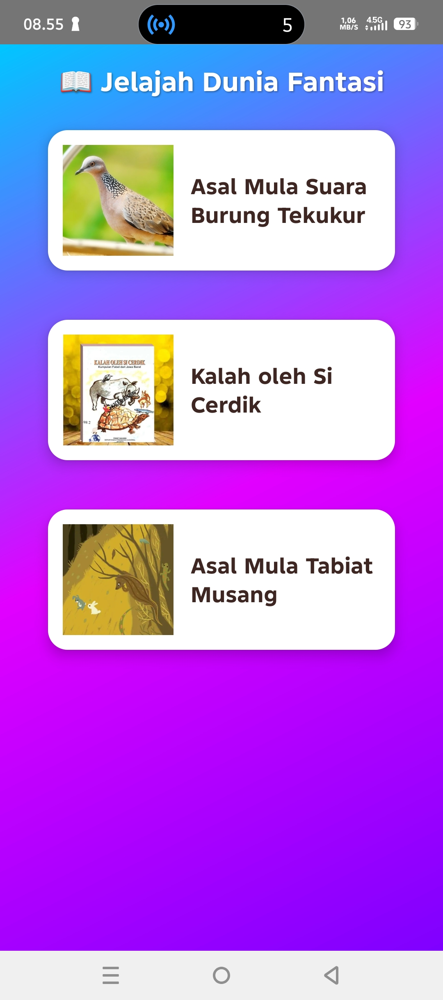
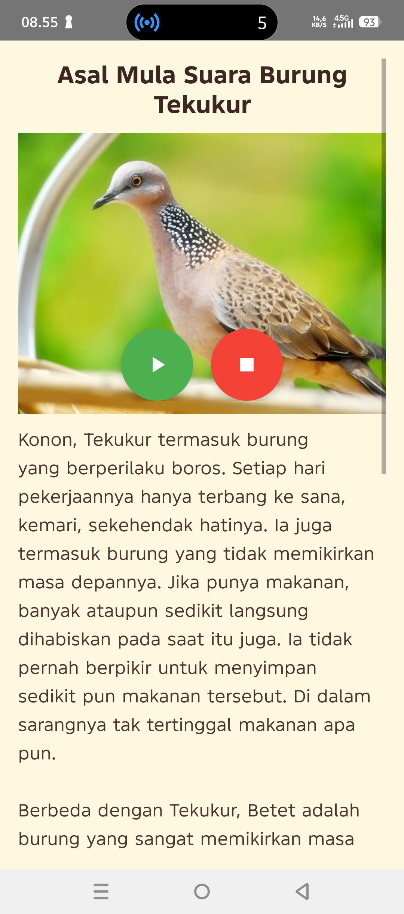
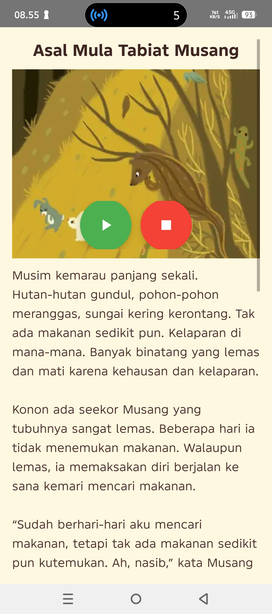

# 📖 Buku Cerita Anak — *Jelajah Fantasy*

Aplikasi interaktif untuk membaca dan mendengarkan cerita anak dengan tampilan menarik serta fitur suara otomatis menggunakan **Google Text-to-Speech (TTS)**.  
Dibuat menggunakan **Android Studio (Java)** dengan antarmuka yang ramah anak dan penuh warna.

---

## 🖼️ Tampilan Aplikasi

### 🏠 Halaman Navigasi
Tampilan awal aplikasi dengan tombol **Mulai Membaca**, **Bagikan Aplikasi**, dan **Beri Ulasan**.
  

---

### 🐦 Asal Mula Suara Burung Tekukur
Halaman cerita pertama dengan gambar dan teks narasi yang dapat dibacakan oleh suara Google.
  

---

### 🦊 Kalah oleh Si Cerdik
Cerita kedua dengan tampilan gambar dan teks yang rapi.
  

---

### 🐹 Asal Mula Tabiat Musang
Cerita ketiga dengan ilustrasi dan narasi yang dapat dibacakan secara otomatis.
  

---

## 💡 Keterangan
- Desain **UI/UX ramah anak** dan mudah digunakan.  
- Fitur **Text-to-Speech (TTS)** untuk membacakan cerita otomatis.  
- Cerita dan gambar dikelola melalui file `data.json` dan folder `assets/image`.  

---

## 👤 Identitas Pengembang
**Nama:** Muhammad Al Qadar Ramadhan  
**NIM:** 237200003  

---

© 2025 Buku Cerita Anak — *Jelajah Fantasy*

